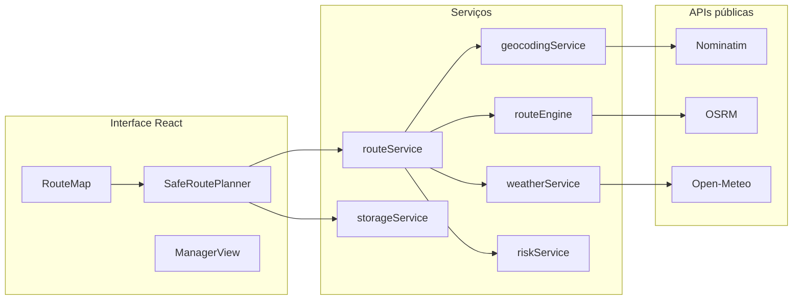

# OrbitTwin Cloud

Gêmeo digital urbano para **planejar rotas seguras** em São Paulo, cruzando geolocalização, roteamento em tempo real, clima e zonas de risco de alagamento — com interface pensada para o cidadão e para a gestão pública.

Desenvolvido para a **Global Solution 2026** (FIAP) · trilha **Cloud Solutions & Scalable Infrastructure** · tema **Indústria Espacial**.

---

## Demonstração

| Ambiente | URL |
|----------|-----|
| **GitHub Pages** | `https://SEU_USUARIO.github.io/orbittwin-cloud/` |
| **Docker local** | `http://localhost:8080` |
| **Vite (dev)** | `http://127.0.0.1:5173` |

Substitua `SEU_USUARIO` pelo seu usuário GitHub após o primeiro deploy.

---

## O problema que resolve

Em eventos de chuva intensa, a rota mais rápida nem sempre é a mais segura. O OrbitTwin compara duas trajetórias no mesmo mapa:

- **Rota convencional** — caminho direto via OSRM  
- **Rota OrbitTwin** — desvio calculado para evitar zonas críticas de alagamento e bloqueio  

O sistema explica *por que* a rota segura é recomendada, exibe clima ao longo do trajeto e registra simulações para consulta posterior.

---

## Funcionalidades

### Planejador de rota segura
- Busca de endereço em linguagem natural (ex.: *Avenida Paulista* → *Estação Santo Amaro*)
- Autocomplete com debounce (**Nominatim** / OpenStreetMap)
- Botão **Usar exemplo** para demonstração rápida
- Perfis de viagem: Cidadão, Pedestre, Motorista, Ciclista, Emergência

### Mapa interativo (Leaflet)
- Polígonos de risco (alagamento, deslizamento, bloqueios)
- Rotas sobrepostas: convencional (vermelho tracejado) e OrbitTwin (ciano)
- Camadas: sensores IoT, hospitais/escolas, bloqueios, clima
- Marcadores de origem e destino

### Inteligência da rota
- Score de risco 0–100 por trajeto
- Comparação de exposição, tempo extra e distância
- Painel climático (**Open-Meteo**): chuva, probabilidade, temperatura, umidade
- Mensagens em linguagem clara para o cidadão

### Modo Gestor
- KPIs operacionais e alertas por região
- Mapa regional com seleção de área
- Simulação de leitura orbital (atualização de sensores)
- **Relatório da simulação** em modal estruturado

### Histórico operacional
- Persistência no navegador (`localStorage`, schema v2)
- Recarga e limpeza do histórico
- Eventos com snapshot da simulação (origem, destino, riscos, clima)

---

## Stack tecnológica

| Camada | Tecnologia |
|--------|------------|
| UI | React 19 + TypeScript |
| Build | Vite 8 |
| Mapas | Leaflet + OpenStreetMap tiles |
| Geocoding | Nominatim (OSM) |
| Roteamento | OSRM (driving) |
| Clima | Open-Meteo |
| Testes E2E | Playwright (smoke) |
| Container | Docker multi-stage (Node → nginx:alpine) |
| Deploy | GitHub Actions → GitHub Pages |

---

## Início rápido

### Pré-requisitos
- **Node.js** 20+ (recomendado 22)
- **npm** 10+

### Instalação e desenvolvimento

```bash
git clone https://github.com/SEU_USUARIO/orbittwin-cloud.git
cd orbittwin-cloud
npm install
npm run dev
```

Abra `http://127.0.0.1:5173` no navegador.

### Scripts disponíveis

| Comando | Descrição |
|---------|-----------|
| `npm run dev` | Servidor de desenvolvimento Vite |
| `npm run build` | Type-check + build de produção em `dist/` |
| `npm run preview` | Preview do build (caminho `/orbittwin-cloud/`) |
| `npm run smoke` | Teste E2E com Playwright (app deve estar rodando) |

### Smoke test

```bash
# Terminal 1
npm run dev

# Terminal 2
npm run smoke
```

Se o Vite usar outra porta:

```powershell
# Windows PowerShell
$env:APP_URL="http://127.0.0.1:5176/"
npm run smoke
```

```bash
# Linux / macOS
APP_URL=http://127.0.0.1:5176/ npm run smoke
```

---

## Docker

Build e execução com nginx servindo o `dist/`:

```bash
docker build -t orbittwin-cloud .
docker run -d -p 8080:80 --name orbittwin-cloud orbittwin-cloud
```

Acesse **http://localhost:8080**.

> O container usa `npm run build` com o mesmo `base` configurado no Vite. Para servir em subcaminho no nginx, ajuste a configuração do servidor se necessário.

---

## Deploy no GitHub Pages

Publicação automática a cada **push na branch `main`**.

### 1. Configurar o repositório

1. Envie o código para `github.com/SEU_USUARIO/orbittwin-cloud`
2. Em **Settings → Pages → Build and deployment**, defina **Source: GitHub Actions**

### 2. Ajustar o `base` do Vite

O arquivo `vite.config.ts` já está preparado para o repositório `orbittwin-cloud`:

```ts
const GITHUB_PAGES_BASE = "/orbittwin-cloud/";
```

Se renomear o repositório, altere essa constante e faça um novo deploy.

| Comando | `base` |
|---------|--------|
| `npm run dev` | `/` |
| `npm run build` / `preview` | `/orbittwin-cloud/` |

### 3. Pipeline (CI)

O workflow `.github/workflows/deploy.yml` executa:

1. `npm ci`
2. `npm run smoke` (servidor dev temporário + Playwright)
3. `npm run build`
4. Publicação via `upload-pages-artifact@v3` + `deploy-pages@v4`

### 4. URL publicada

```
https://SEU_USUARIO.github.io/orbittwin-cloud/
```

Acompanhe em **Actions** → *Deploy GitHub Pages* e em **Settings → Pages**.

### Build local (igual ao CI)

```bash
npm ci
npm run build
npm run preview
# http://127.0.0.1:4173/orbittwin-cloud/
```

---

## Arquitetura



### Estrutura de pastas

```
orbittwin-cloud/
├── .github/workflows/deploy.yml   # CI/CD GitHub Pages
├── public/.nojekyll               # Evita Jekyll no Pages
├── scripts/smoke.mjs              # Teste E2E
├── src/
│   ├── App.tsx                    # Modos Cidadão / Gestor
│   ├── components/
│   │   ├── SafeRoutePlanner.tsx   # Fluxo principal
│   │   ├── AddressSearch.tsx
│   │   ├── RouteMap.tsx
│   │   ├── RouteSummary.tsx
│   │   ├── WeatherPanel.tsx
│   │   ├── ManagerView.tsx
│   │   └── ReportModal.tsx
│   ├── hooks/useSafeRoutePlanner.ts
│   ├── services/
│   │   ├── geocodingService.ts
│   │   ├── routeService.ts        # planSafeRoute()
│   │   ├── routeEngine.ts         # OSRM + desvios
│   │   ├── weatherService.ts
│   │   ├── riskService.ts
│   │   └── storageService.ts
│   ├── data/riskZones.ts          # Polígonos SP
│   └── utils/riskGeometry.ts
├── style.css
├── Dockerfile
├── vite.config.ts
└── package.json
```

### Integrações

| API | Uso | Fallback |
|-----|-----|----------|
| **Nominatim** | Texto → coordenadas | POIs locais de São Paulo |
| **OSRM** | Geometria de rota real | Rota simplificada origem–destino |
| **Open-Meteo** | Previsão no trajeto | Clima simulado |
| **Zonas locais** | `riskZones.ts` | Polígonos representativos (não oficiais) |

---

## Fluxo do usuário

1. Informe **origem** e **destino** (ou use **Usar exemplo**)
2. Escolha o **perfil** de deslocamento
3. Clique em **Calcular rota segura**
4. Compare rotas, clima e explicação no mapa
5. Consulte o **histórico** (salvo automaticamente)
6. No modo **Gestor**, gere o **relatório da simulação**

---

## Modos de uso

| Modo | Público | O que vê |
|------|---------|----------|
| **Cidadão** | População | Planejador focado, mensagem simples, mapa da rota |
| **Gestor** | Defesa Civil / operação | Tudo do cidadão + KPIs, alertas, mapa regional, simulação orbital |

---

## Limitações conhecidas

- Zonas de risco são **representativas** (MVP acadêmico), não dados oficiais da Prefeitura ou CEMADEN
- APIs públicas (Nominatim, OSRM) têm **rate limit** e podem falhar — há modo de contingência
- Histórico salvo apenas no **navegador** (`localStorage`)
- Relatório em **modal HTML**, sem exportação PDF
- `package.json` usa algumas dependências em `latest`; em produção recomenda-se fixar versões

---

## Roadmap

- [ ] Backend para histórico centralizado (PostgreSQL / Cosmos DB)
- [ ] Integração com dados oficiais de alagamento
- [ ] Autocomplete premium (Mapbox / Google Places)
- [ ] Notificações em eventos críticos
- [ ] Exportação PDF do relatório operacional

---

## Licença e autor

Projeto acadêmico — **Global Solution 2026** · FIAP · Indústria Espacial.

Adicione aqui seu nome, turma e link do perfil GitHub, se desejar.
